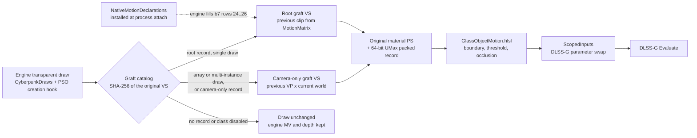

# Glass: engine-supplied motion for transparent surfaces in DLSS Frame Generation

- Created: 2026-09-10
- Updated: 2026-09-23
- Status: product path. The previous-frame position of a transparent draw comes from the engine: its MotionMatrix supply through a root graft, or its previous camera through a camera-only graft. Module vertex history is an off-by-default diagnostic fallback. In-game results cover only the scenes in [Verification results](#verification-results). Full coverage (C12) and the 1 ms budget (C13) are not met.
- Applied: `glass-motion` branch of this fork, deployed as `dxgi.dll` through MO2. Source defaults keep the correction off.
- Deprecated: no
- Scope: in-world transparent surfaces of Cyberpunk 2077, HUD excluded. Only the DLSS-G (FG) evaluation receives substituted motion and depth. DLSS-SR, Ray Reconstruction and ray-traced passes read the unchanged engine textures.
- Base: `7b7220bbb4994a9c8ae60cfc75a44cb67995efb8` (tags `nightly`, `v10.0.0-dev-fork-y4my4my4m-v4`), branch `dlss-neural-rendering` of the fork `y4my4my4m/OptiScaler_DLSSNR_Multipass_MFG`, not official `optiscaler/OptiScaler`. The git remote `upstream` of this repository is that fork. The port onto official OptiScaler is described in [Port to official + wilsjo2 DLSSNR](#port-to-official--wilsjo2-dlssnr).

The conditions C1–C22 are defined in the workspace file `research/objective.md`. The resume point and raw-evidence index is the workspace file `research/ACTIVE.md`. Line numbers cited below refer to the revision of that file that contains the section "통합 빌드 게임 검증 (2026-09-23 16:36~)". Related documents:

- [EngineMotionSupply.md](EngineMotionSupply.md): evidence for the engine supply (MotionMatrix evaluator, declaration hook, grafts, array convention).
- [SupportMatrix.md](SupportMatrix.md): coverage by vertex factory and material family.
- Workspace `docs/glass-engine-supply-integration.md`: decision record for camera-only arrays, the opaque occlusion test and the vertex-factory rule.
- [CompletionPlan.md](CompletionPlan.md): the plan and its 2026-09-23 status.

Outside `framegen/glass/`, the module reaches the base fork's code only through explicit calls: `OptiScaler.vcxproj` imports `GlassFg.props`, `dllmain.cpp` calls `InstallNativeMotionDeclarations` at process attach, the D3D12 device hook starts the geometry host, the native FG Evaluate branch and the NGX provider hook call `NativeHost`, the `nvngx_dlssg.dll` load branch installs that provider hook, the Streamline common-plugin loader calls the tag bridge, the menu draws the Glass settings, and the fork's DLSS-NR pass takes the composed guides when `NrMotion` is on. [Port to official + wilsjo2 DLSSNR](#port-to-official--wilsjo2-dlssnr) lists the nine seams. ASI loading and the MFG unlock are neither Glass code nor official OptiScaler code: `version.dll` loads `plugins/mfg-unlock.asi`, and the base fork carries its own optional `MfgUnlock` ([MFG unlock](#mfg-unlock-not-part-of-glass)).

## Pipeline



### 1. Capture: engine draws

At D3D12 device creation (`D3D12_Hooks.cpp:2245`), `GeometryHost.cpp` checks the Cyberpunk executable and the packaged `Glass/dxcompiler.dll` and `Glass/dxil.dll`. It then installs the PSO creation hooks (`GeometryCreation.cpp`), the engine object, draw and group hooks (`CyberpunkObjects.cpp`, `CyberpunkDraws.cpp`, `CyberpunkGroups.cpp`), the command hooks and the native D3D12 observer (`GeometryHost.cpp:86-105`). Engine functions are located through audited instruction-layout signatures (`CyberpunkLayoutProfile.h`), not fixed addresses (C16). A failed step leaves the game unchanged and shows in the `GEOMETRY_HEALTH capabilities=` log line.

`CyberpunkDraws.cpp` reads the renderer's batch, append and flush records. It attributes each observed `DrawIndexedInstanced` from the audited engine call site to its proxy, mesh chunk, instance span and render frame (`CyberpunkDraws.h:7-18`). `GlassMotionIdentity.cpp` builds the object identity from the draw's batch span, the object's registration lifetime, the bound depth target and, for grouped arrays, the element list published by the module's group hooks (`GlassMotionIdentity.h:6-11`).

### 2. Capture: the graft catalog

`GeometryPipelineCache.cpp` compiles a packed variant for every transparent PSO the game creates. It runs on the pipeline-cache worker, never in a draw callback. The worker hashes the original VS container once (SHA-256) and looks it up in `Glass/grafts/index.bin` (`GGRAFT02`, 52-byte records, `NativeGraftCatalog.cpp:18-27`). The outcome of a pipeline job is final; a miss is not retried per frame (`GeometryPipelineCache.cpp:281-362`).

| Record kind | VS used for the packed variant | Previous clip | Used for |
| --- | --- | --- | --- |
| Root graft (`<sha>.dxil`) | original transparent VS plus the previous-position arithmetic copied from its native velocity-VS twin | engine MotionMatrix, material constant buffer b7 rows 24..26 | single-instance draws |
| Camera variant of a root graft (`<sha>.camera.dxil`) | same original VS | native previous view-projection (b1 rows 16..19 or 12..15) applied to the VS's own current world position | array, grouped and multi-instance draws of the same PSO |
| Camera-only record (no `<sha>.dxil`) | original VS without a native twin, or whose twin was refused by the factory rule or has no validated root graft | same camera-only form: the twin's camera multiply, or for a VS without a twin one of two canonical templates (`50ba90d4…` for b1 28..31 → 16..19, `79f7efb4…` for 0..3 → 12..15) | every draw of that VS |

Both graft kinds keep every original output. They add two float4 outputs: the engine's de-jittered current clip (`XY − b1[51].xy·W`) and the previous clip (`NativeGraftCatalog.h:9-22`, `EngineMotionSupply.md` "Current clip convention"). The pixel stage computes `(previous UV − current UV)` with no jitter term and no capture delta (`DxilVertexHistory.h:218-222`). Graft draws read no module history. They take identity-only mappings (object ID and live generation, no history-arena block), so a full vertex-history arena cannot reject them (commit `a6712d09b`, `PackedMotionCapture.cpp:639-645`).

The root graft works only if the engine actually fills rows 24..26 for the transparent material. `NativeMotionDeclarations.cpp` makes it do so. At DLL process attach, before the shader-cache provider builds any compiled layout, it detours the provider metadata getter and the vertex-stage resolution. For the declared VS/PS pairs it returns an immutable copy of the native declaration with `MatMod_MotionMatrix` added at row 24; the engine's own evaluator then writes the rows (`NativeMotionDeclarations.h:6-27`). Data: `Glass/motion-declarations.bin` (`GMDPLAN1`) and `Glass/motion-shader-pairs.bin` (`GMSPAIR1`). This replaces the RED4ext `GlassMotion` plugin used through 2026-09-23 (commits `f07b40c28`, `592de369b`). The plugin must be removed from `red4ext/plugins/`; two detours on one entry are not supported.

Selection rules:

- Array, grouped and multi-instance draws of a root-graft pipeline use the camera variant. The engine keeps no per-element previous transform. Its own velocity for array elements is the previous view-projection applied to the element's current world position (`research/ACTIVE.md:77`, `EngineMotionSupply.md:547-554`). Applying the root transform to every element measured 81 px of error on a still camera (`research/ACTIVE.md:77`).
- A skinned-factory target does not take a root graft from a twin of another vertex factory whose previous graph is root-only. Such targets become camera-only records (`factory_mismatch`; commits `680525741`, `2bef442ff`; `tools/AGENTS.md:26`).
- `GraftClassMask` admits records by the supply class of their previous graph: bit 0 root-only, bit 1 skinned (t10), bit 2 preskinned (t9/b3). The default is 1, root only (`GlassControls.h:261-277`, `GlassSettings.cpp:80-81`). A default of 3 was tried on DLL `0c5bb34e` and withdrawn: in all six still frames the NPC head region (hair and glasses, skinned class 2) delivered about 77 px where the engine had about 3.5 px (`research/ACTIVE.md:128`). A disabled class counts `class_disabled` and keeps the engine values.
- A VS without a record counts `missing` and keeps the engine values. `VertexHistoryFallback` (default off) re-enables the old module vertex-history variant for diagnostics only. That path does not satisfy C2.

Catalog regeneration is local only; the output contains extracted game shader code and stays in the ignored `artifacts/` tree. `tools/graft_native_motion.py --workspace <dir>` writes the grafts, `tools/verify_native_grafts.py --workspace <dir>` checks them, and the exporter accepts only records that pass every check (`tools/AGENTS.md:18`, `26-27`). Export from the workspace root (`research/ACTIVE.md:43`):

```powershell
python glass-optiscaler-source\OptiScaler\framegen\glass\tools\export_native_grafts.py --workspace glass-native-material-v1 --out glass-optiscaler-source\artifacts\glass-grafts\Glass
```

`motion-declarations.bin` is a copy of `glass-native-material-v1/pending-motion-declarations/declarations.bin`. `motion-shader-pairs.bin` is a copy of `pending-motion-declarations/shader-pairs-2018-direct-span-clear.bin` (SHA-256 `827bf29b…`): the 2,018 pairs whose direct writer spans are fully classified. The six pairs with an unresolved modifier 0 are not used (`EngineMotionSupply.md:588-593`, `research/ACTIVE.md:126`). Both files sit in `artifacts/glass-grafts/Glass/` (`GlassFg.props:102-108`). `GlassFg.props` copies the catalog and the declaration data into `Glass/` beside the built DLL when they exist. Without the catalog every pipeline counts as a graft miss. Without the declaration data the hook stays uninstalled with status `declaration_file_missing`. The build copy never deletes files: after a record loses its root graft, delete the stale `<sha>.dxil` from the build output. `glass-game.ps1 -Action deploy` replaces the deployed `grafts` directory as a whole (`glass-live-tools/glass-game.ps1:123-136`). The integration deploy moved the RED4ext `GlassMotion` plugin into `glass-deploy-backup-20260923-163549/red4ext-plugins-GlassMotion` (`research/ACTIVE.md:126`).

### 3. Capture: packed records

`PackedMotionCapture::prepare` admits the draw, selects the root or camera variant and binds the packed target. The rewritten material PS (`DxilVertexHistory.cpp`, `PackedMotionShader.h`) keeps the original colour exports, blending and discard. After the material body it writes one 64-bit record per pixel with `InterlockedMax` (`atomicBinOp.i64` opcode 7, unsigned max):

| Bits | Field |
| --- | --- |
| 63 | covered class: material opacity ≥ interior threshold |
| 62..46 | 17-bit depth key, ordered so that nearer is larger |
| 45..35, 34..24 | motion X and Y, signed 11 bits in 1/8 px (±128 px) |
| 23..16 | material opacity, 8 bits |
| 15 | reverse-depth flag of the draw |
| 14..0 | per-frame object ID (1..32767) |

Opacity is `1 − mean(RGB transmission)` from the original blend equation. The coverage-only fallback variant, used when the equation cannot be read, records opacity 0 and therefore contributes only its boundary unless the threshold is 0. Because the store is an unsigned max, a covered record outranks an uncovered one, and within a class the nearest surface wins (C8) (`PackedMotionShader.h:105-146`). A draw whose motion at a pixel exceeds ±128 px writes no record there (`PackedMotionShader.h:82-89`); the pixel keeps the engine value unless another surface recorded it.

### 4. Compose: `GlassObjectMotion.hlsl`

`ApplyObjectMotion` runs on the module's own command list. That list is executed on the FG queue after the wait on the packed producer's fence (`PackedMotionGpu.h:1092-1150`, `NativeSession.h:533-544`). It first copies the engine MV and depth into owned textures (`PackedMotionGpu.h:1591-1602`). Per pixel:

1. No record: engine value kept.
2. Boundary: a neighbour within `BorderWidthPx` (1..4, all 8 directions) carries a different object ID. Boundary pixels are taken whatever their opacity (C3, C4b).
3. Interior: taken only when the covered bit is set (C4).
4. Opaque occlusion: when the engine depth is nearer than the record by more than 4 depth-key quanta, the visible surface is an opaque one drawn after the transparent pass. The pixel keeps the engine value (counter slot 15, dump field `occluded`). The depth direction comes from the frame's `DLSSG.DepthInverted` (commits `32e3ad691`, `c6b772b3e`; `GlassObjectMotion.hlsl:253-276`).
5. Otherwise the pixel receives the object's motion, converted to the engine's normalized MV units, and the record depth. MV z/w keep the engine values.

A pixel either takes the object's motion and depth exactly or keeps the engine value byte for byte. There is no strength, blend, scale or clamp (C21). The delivery jitter convention is fixed at mode 0, gain 100; the INI cannot change it (`GlassSettings.cpp:102-107`). Other jitter modes, the engine-proximity gate (`enggate=`, `gatepx=`), `depthkeep=` and `stripes=` exist only as live-channel diagnostics (C7).

### 5. Substitution: `ScopedInputs`

`NativeHost` intercepts the native DLSS-G Evaluate. An evaluation counts as frame generation when its parameter table carries a `DLSSG.*` marker key, when its handle was already learned as FG, or when the caller is the DLSS-G provider or Streamline's FG plugin. Every other evaluation, including DLSS-SR and Ray Reconstruction, which share the `MotionVectors`/`Depth` names, passes through with no session, GPU work or parameter change (`NativeHost.cpp:1595-1663`, `GlassFgPass.h:41-54`).

For an FG evaluation, `NativeSession::prepare` returns the owned MV/depth pair, and `ScopedInputs` swaps only the parameter-table pointers the provider reads (`DLSSG.MVecs`/`DLSSG.Depth`, or `MotionVectors`/`Depth` on the driver-level table) for the duration of the original call. The destructor restores them on return or unwind (`GlassFgPass.h:208-270`, `NativeHost.cpp:1818-1825`). The engine textures are never written (`controls … engine_writes=0` in the status response). `NrMotion` (default off) additionally hands the same pair to DLSS-NR as its guides (C9 option).

The DLSS-NR pair is composed on the upscaler's own command list and read there, so that list holds session resources until the game resets or destroys it, and each execution of it until a per-queue fence signalled right behind its batch completes. A retiring session is released only after both (`InlineRecordings` in `NativeSession.h`); `tests/NativeSession.cpp` covers the unsubmitted, resubmittable, in-flight and destroyed cases.

## Live channel, counters and dumps

The game process polls `Glass/glass-debug.request` once per second and answers in `Glass/glass-debug.response` (`GlassDebugControl.h:6-9`). Use `glass-live-tools\glass-ctl.ps1 -Command <cmd>[,<cmd>]`. Main commands: `status`, `probe` (compose on, substitution off), `apply` (substitution on), `substitute=on|off`, `dump`, `fgdump=N`, `opacity=N`, `edge=N`, `rows=N`, `graftclass=N`, `vhfallback=on|off`, `opaqueprobe=on|off`, `reload-shader`, `soft-reload`. The full list is in `GlassDebugControl.cpp`. `graftclass=` and `vhfallback=` apply only to pipelines compiled afterwards; a changed class mask needs the INI value and a restart (`research/ACTIVE.md:56`).

Status lines:

| Line | Fields |
| --- | --- |
| `GRAFT` | `ready` root-graft pipelines, `missing` VS without a record, `rejected` graft rewrite or compile failures, `class_disabled`, `camera_only` camera-only-record pipelines, `array_ready`/`array_missing` camera variants of root-graft pipelines, `array_rejected` array draws without a usable variant, `array_draws`, `draws`, `fg_evals` (substituted FG evaluations whose capture frame drew at least one graft variant with the fallback off, `NativeHost.cpp:1983-1987`), `catalog` record count, `classmask`, `vhfallback` |
| `DECL` | `hook` 1 when both detours are installed, `seen` provider results, `matched` augmented declarations returned, `rejected` declared keys whose native record differed from the plan, `stage_seen`, `stage_selected`, `status` (`installed`, `not_cyberpunk`, `native_layout_rejected`, `declaration_file_missing`, `declaration_profile_rejected`, `hook_attach_failed`) |
| `packed` | admission and frame counters, `fg_frames`, `history_bypassed` (graft draws admitted without an arena block) |
| `controls`, `identity` | control word and identity rejection split |

Dumps:

- `dump` writes the next composed frame to `Glass/dump-<n>*`: the delivered and engine MV (`*-mv.f32`, `*-original-mv.f32`), both depths, the packed records, the colour image, and a text header with `dispatched_pixels`, `packed_pixels`, `edge_pixels`, `interior_pixels`, opacity and outcome buckets, `gate_skip`/`gate_px`, `depth_sub`, `stripe_skip` and `occluded` (`PackedMotionGpu.h:1442-1509`). `glass-live-tools\glass-dump-series.ps1 -Count N -Out <dir>` collects a series. `python glass-live-tools\glass_graft_residual.py <dir>` reports, per frame, the substituted pixel count, the delivered and engine |MV| medians and the residual `|delivered − engine|` on substituted pixels. The residual is a consistency measure. It is expected to be near zero where the surface and the content behind it share the camera's motion, and intentionally nonzero where an object moves behind still glass.
- Per-pipeline coverage. With `gate=on`, each module report adds `GEOMETRY_PIPELINES n= drawn= captured= shown= draws= captures=`. When a counter has moved, up to 256 `GEOMETRY_PIPELINE id= vs= ps= kind= history= draws= captures= graft= array= array_rejected= gates=` lines follow, most drawn first. The counts run from `gate=on`/`gate=reset` and cover only draws that reached the packed capture. `gates=name:count,...` (`-` when none) lists the admission gates that refused the pipeline's draws (`notpacked`, `root`, `mapping`, `raster`, `shape`, `viewport`, `frameslot`, `ordering`, `noelement`) or single elements of its draws (`span_owner`, `span_resolve`, `span_mismatch`, `span_field`, `span_array`, `history`; `GeometryPipelineCache.h` `CoverageGate`). The `GATE_DETAIL` admit, array and history lines name the same `pipeline=` id. `GEOMETRY_GATE prepare_lock` stays 0: a recording thread that finds the capture mutex busy waits for it (`prepare_lock_wait` counts those waits) instead of dropping the draw (`PackedMotionCapture.cpp` `Capture::status`). `vs`/`ps` are the first 16 hex digits of the SHA-256 of the original VS/PS containers. They match `programs[].sha256` in `glass-native-material-v1/all-cache-techniques.json`. `kind` is the graft outcome of the pipeline job (`GeometryPipelineCache.h`). Each `dump` also writes `dump-<n>-pipelines.txt`, which lists `id pipeline vs16 ps16 kind variant` for the object ids in `dump-<n>-packrec.bin`. To make that table complete, the capture holds the dump back by the frame or two it needs, and by at most 32 composes. The `packrec= pipelines= pipeline_records= pipeline_ids= pipelines_complete= pipelines_deferred=` line of `dump-<n>.txt` records the result, and `glass-dump-contract.ps1` copies both files when that line announces them (`PackedMotionCapture.h`). `python glass-live-tools\glass_pipeline_coverage.py <series> [--log <OptiScaler.Glass.log>]` joins these to catalog material names. Per pipeline it reports substituted pixels and the residual, and it lists the pipelines that were drawn but never captured and, for the captured ones, captures against eligible draws (draws that no draw-level gate refused), each with its gate split.
- `fgdump=N` copies the DLSS-G output texture of N executed evaluations after the request is armed into `Glass/fgdump-<serial>-*.ppm` plus a manifest. The observed sessions resolved the key `DLSSG.OutputInterpolated` (`research/ACTIVE.md:88`). Copies are recorded on the FG command list and read back after per-queue fence completion, with no CPU wait in Evaluate (commits `5f0e2388e`, `433f2f60d`). `glass-live-tools\glass-fgdump.ps1 -Count N -Out <dir>` collects them. Rendered and generated frames are separated by consecutive-output differences (`research/ACTIVE.md:93`).
- Log: MO2 `overwrite\bin\x64\OptiScaler.Glass.log`.

## Settings

`OptiScaler.Glass.ini` beside the DLL, section `[GlassFG]`; the menu window saves and reloads the same file. Without the file the hooks stay idle (`GlassSettings.cpp:26-38`).

| Key | Default | Meaning |
| --- | --- | --- |
| `Enabled` | false | master switch; hooks stay idle while off |
| `ReplaceFrameGenerationInputs` | false | substitute FG motion and depth (live `apply` / `substitute=on`) |
| `ComposePass`, `ComposeRows` | true, 240 | compose dispatch and the rows it covers from the top (1..32768); rows must cover the render height for full-frame delivery |
| `InteriorOpacityPercent` | 50 | interior threshold (C4) |
| `BorderWidthPx` | 2 | boundary band, 1..4 px (C3) |
| `GraftClassMask` | 1 | admitted supply classes (bit 0 root, bit 1 skinned, bit 2 preskinned); 3 was withdrawn (`research/ACTIVE.md:128`) |
| `VertexHistoryFallback` | false | diagnostic module vertex history; not C2 |
| `NrMotion` | false | also supply DLSS-NR guides (C9 option) |
| `OpaqueProbe` | false | diagnostic: admit opaque pipelines to compare with engine MV. It was left on in the deployed INI before the integration build; most `occluded` pixels of the earlier P6 run came from those opaque pipelines (`research/ACTIVE.md:127`) |
| `SkipFartherThanMeters` | 0 | far cutoff in 25 m steps, 0 keeps every surface |
| `MeasureGpuTime` | true | sparse GPU timestamps of the compose |

The legacy keys `Strength`, `InteriorFollowPercent`, `InteriorLimitPx`, `JitterMode`, `JitterGain`, `JitterCompensation`, `JitterGainPercent`, `PackedWriteBack` and `EngineArrayElementMapping` are not read and are removed on save (`GlassSettings.cpp:149-157`).

## Build, deploy and verify

Commands from the workspace root (`AGENTS.md` "빌드와 검사", "게임 배포와 실행"):

| Step | Command |
| --- | --- |
| Build | `cmd /c glass-live-tools\glass-build.bat` → `glass-optiscaler-source\x64\Release\a\OptiScaler.dll` and `a\Glass\` |
| Geometry contract | `cmd /c glass-live-tools\glass-geometry-tests.bat` |
| Diagnostic contract | `python glass-live-tools\_bin_glass_diag_check.py <dll> --out <json>` |
| Recording ownership | `cmd /c glass-live-tools\glass-recording-tests.bat` |
| Standalone tests | x64 VS Developer PowerShell in `glass-optiscaler-source`: `.\OptiScaler\framegen\glass\tests\run-tests.ps1` (refuses while the game runs) |
| Deploy (game closed) | `glass-live-tools\glass-game.ps1 -Action deploy`: backup `glass-deploy-backup-<time>`, then the DLL, `GlassObjectMotion.hlsl`, the graft catalog and the declaration data into the MO2 layers |
| Deployment integrity | `glass-live-tools\glass-deploy-verify.ps1` |
| Launch | `glass-live-tools\glass-game.ps1 -Action preflight`, then `-Action start`; relaunch with `stop` then `start` (`glass-live-tools\glass-launch.md`) |
| Live check | `glass-live-tools\glass-ctl.ps1 -Command status,apply`, then `glass-dump-series.ps1` and `glass-fgdump.ps1` |
| Scene relocation (CET) | `glass-live-tools\glass-cet.ps1 -Action deploy` copies the `glass-verify` CET mod (`glass-live-tools\cet\glass-verify\init.lua`) into MO2 `overwrite`; it loads at the next launch. In game: `glass-teleport.ps1 -Save club` first, then `-Preset neon\|neon-alt\|rain\|traffic\|club`, `-Weather <id>\|reset`, `-Time hh:mm`, `-Where` (file channel, no hotkey or focus). `glass-cet.ps1 -Action status` shows whether the session loaded the mod |
| FG off evidence | `glass-live-tools\glass-fg-setting.ps1 -Action off` → restart → capture → `-Action restore`. `substitute=off` is not FG-off evidence (`research/objective.md:29`) |

Launch only through the MO2 script path, on the last active monitor at 3840×2160, and run FG tests only while the window is in the foreground and `fg_frames` advances (`research/objective.md:23`). A module change requires a restart; other experiments use the live channel.

## Verification results

All results are from 2026-09-23 at a 2560×1440 render size (dump headers). "Residual" is `|delivered − engine|` on substituted pixels from `glass_graft_residual.py`. Paths are under the workspace `glass-live-tools/` unless noted. Directories marked † are not named in `research/ACTIVE.md`. They were matched to the run by time and dump headers; for example, `scene-20260923d/ceiling-fast360/frame-2/dump-1.txt` has `engine_covered_pixels=18856`, the `sub 18,856` of `research/ACTIVE.md:87`.

| Run (DLL, pid) | Scene | Result | Source | Raw data |
| --- | --- | --- | --- | --- |
| `585b8df5`, 42328, 13:34–14:20; root grafts, RED4ext declaration plugin | still, 24 frames | delivered MV exactly 0 px; boundary `gt0.5` 205–916 (2026-09-18 mode 3: 13,590, mode 5: 55,190) | ACTIVE.md:50 | `mv-graft-still-20260923/` |
| same | moving, 14 frames | delivered \|MV\| ≈ engine \|MV\| (42 px); residual mean 0.1–0.4 px | ACTIVE.md:50 | `mv-graft-move-20260923/` |
| same | Songbird ceiling and chandelier, fast rotation up to 127 px/frame | residual mean 0.08–0.25 px; >1 px 0–1.1% | ACTIVE.md:51 | `scene-20260923/` |
| same | glass/cup table | 0 substitutions: instanced array draws rejected by the array gate | ACTIVE.md:52 | `artifacts/glasses2-f11-full.png` (workspace) |
| same | NPC eyewear and head attachments | wrong MV, residual 6–82 px, also with a still camera | ACTIVE.md:53 | same image |
| same | railing behind a near NPC | railing MV written where the engine depth is the NPC | ACTIVE.md:54 | `scene-20260923/glasses-fast-dumps/frame-7` (y 417–502, x 85–228) |
| same | generated frames | desktop capture at 73 fps; generated frames not identifiable, no verdict | ACTIVE.md:55 | `scene-20260923/ceiling-fg/`, `glasses-fg/` |
| `538e463e` (`graftarray=on` probe) | glass table, still | root graft applied to array draws: 81 px error | ACTIVE.md:69, 77 | † `scene-20260923b/glasses-array-still/` |
| `f853a540` + occlusion shader, 4392 | glass table with the camera-only array variant | substitution 0 → all array draws (`array_draws=51,718`); still: delivered p50 0.28 px vs engine 0.33 px; moving: 67 vs 67 px | ACTIVE.md:78 | † `scene-20260923c/glasses-still/`, `glasses-move/` |
| same | opaque occlusion (NPC arm and glasses in front of glass) | residual mean 0.8–4.4 → 0.3–1.1 px; >1 px 12–30% → 5–14%. Remaining >1 px: NPC moving behind the glass (engine 7 px = NPC, delivered 0.3 px = glass), the intended correction | ACTIVE.md:79 | † `scene-20260923c/glasses-still-occl/` |
| same | quest icon | not substituted (0 px): drawn by DrawBuffer `ui_panel`/`ui_default_*` VS without an engine velocity twin | ACTIVE.md:80 | † `scene-20260923c/icon-move/` |
| `b9cf9e82`, 34300 | Songbird ceiling, still, 6 frames | residual mean 0.06–0.13 px; >1 px 0.3–2.4%. `occluded` 136,859–137,240 in 5 of 6 frames; frame 5 has 126,657 with a smaller captured area (`packed_pixels` 381,693 vs about 396k), not a decision flip | ACTIVE.md:86 | † `scene-20260923d/still/` |
| same | slow rotation, 18–25 px/frame, 8 frames | residual 0.06–0.13 px; >1 px ≤0.1% | ACTIVE.md:87 | † `scene-20260923d/ceiling-slow/` |
| same | fast 360°, 128 px/frame | motion beyond the ±128 px record range: most substituted pixels fall back to engine values (`sub 18,856`); remaining pixels mean 0.92 px. Design limit | ACTIVE.md:87 | † `scene-20260923d/ceiling-fast360/` |
| `9754c134`, 3172 | generated frames A-B-A-B: mezzanine glass railing, far background, fast pan 480 px / 8 steps / 40 ms | mod off: glass pattern smeared over the truss, pillar edges doubled. Mod on: pattern and pillar edges in place and sharp. Glass table: little on/off difference (table and glasses at similar depth) | ACTIVE.md:93-96 | `scene-20260923e/ab7-*`, `ab7-mezzanine-generated-ABAB.png` |
| not named in ACTIVE.md | walking plus camera tracking, 6 segments; forward segments stuck and excluded | real move and turn segments: residual mean 0.02–0.13 px, >1 px ≤1.4%; `right-pan frame-2` (turn 28.8 px + translation −9.9 px): 0.09 px | ACTIVE.md:101-103 | `walk-20260923/` |
| `9364be81`, 34108 | generic camera-only grafts, still | `GRAFT camera_only=183`; substituted area 127k → 508k px; residual 0.04–0.08 px, >1 px ≤0.7% | ACTIVE.md:112 | `scene-20260923f/still/`, `rail-still/` |
| same | generated frames A-B-A-B: railing slats, lamp, quest icon | mod off: slats and lamp doubled or smeared, quest icon "!" doubled. Mod on: slats, lamp and icon single and sharp | ACTIVE.md:113 | `scene-20260923f/ab8-*`, `ab8-railing-icon-generated-ABAB.png` |
| same | NPC glasses | 6 px wrong MV with a still camera: 18 root grafts on skinned/garment targets came from MeshStatic twins. Fixed offline by the factory rule; no dedicated in-game recheck | ACTIVE.md:114, 134 | — |
| `9364be81`, 3188, 15:57 | FG off: profile `FrameGeneration=Off`, restart | host evaluations 0, packed capture not initialized; 69% of consecutive desktop frames identical, so no generated frames; module inactive; `restore` confirmed | ACTIVE.md:117-120 | `scene-20260923f/fgoff-burst/fgoff-pan.mp4` |
| integration build: commit `592de369b`, DLL `0c5bb34e` then `580b24ad`, 16:36~; 5 reviews PASS | declaration hook inside the DLL | `DECL hook=1 seen=7728 matched=250 rejected=0 status=installed`; RED4ext plugin moved to backup | ACTIVE.md:126-127 | — |
| same, `OpaqueProbe=false` | packed capture without the opaque diagnostic | `packed_pixels` ≈110k, `occluded=0`: a transparent draw does not record pixels that fail the engine depth test | ACTIVE.md:127 | — |
| `0c5bb34e`, `GraftClassMask=3` | NPC head (hair, glasses; skinned class 2), still, 6 frames, y 636–758, x 183–303 | delivered ≈77 px vs engine ≈3.5 px in every frame: the skinned previous position is wrong | ACTIVE.md:128 | `p6-20260923b-on/still-npc-head-class2-residual.png` |
| `580b24ad`, `GraftClassMask=1` | same protocol rerun | 77 px region gone; `class_disabled=348~367` | ACTIVE.md:128 | `p6-20260923c-on/` |
| same | remaining unsubstituted VS | 14: 13 outside the transparent inventory (blended decal 11, debugdraw 1, unclassified 1), 1 screen-space particle (`42531526`); no further graft candidates | ACTIVE.md:129 | — |
| `0c5bb34e` / `580b24ad` | compose GPU time | `gpu_ms=0.176` (mask 3), `0.128` (mask 1) | ACTIVE.md:130 | — |

The integration build ran the in-DLL declaration hook, the factory rule, the arena decoupling and the legacy removal together (`research/ACTIVE.md:124-130`). ACTIVE.md records no dedicated recheck of the 6 px NPC-glasses error from the factory rule, and no `history_bypassed` result for the arena decoupling. Rows before 16:36 predate `OpaqueProbe=false`; their `occluded` counts may include opaque-diagnostic pipelines [INFERENCE from `research/ACTIVE.md:127`].

## Known limits and open items

- Skinned transparent draws (class 2), including NPC hair and glasses, keep the engine value by default. [INFERENCE, `research/ACTIVE.md:128`] The transparent pass does not keep the velocity pass's previous skinning supply (previous `INSTANCE_SKINNING_DATA` offset, previous t10 bones), so a skinned root graft reads a wrong previous position.
- The 6 px NPC-glasses error fixed by the factory rule has no dedicated in-game recheck (`research/ACTIVE.md:134`).
- Record range: 11-bit motion at 1/8 px bounds a record to ±128 px. Faster motion keeps the engine value (`research/ACTIVE.md:87`); this bears on C11.
- Coverage: 54 VS without a native twin have no camera-only graft (screen-space 11, two-stage projection 17, no `SV_Position` 6, multiple stores 7, other 13; `research/ACTIVE.md:107`). Preskinned twins (t9/b3) have no root graft. In the integration build, 14 VS stayed unsubstituted, 13 of them outside the transparent inventory (`research/ACTIVE.md:129`). See [SupportMatrix.md](SupportMatrix.md).
- Camera-only records carry camera motion only: independently moving array elements, camera-facing rotation of billboards and particles, and icon anchor motion are not included. This matches the engine's own velocity for those draws (`research/ACTIVE.md:77`, `research/ACTIVE.md:108`).
- Not yet run: the full user protocol (`research/ACTIVE.md:62`); the 2026-09-19 report of railings and panes rotating individually; the quest icon under rotation beyond the A-B-A-B pan; vehicle glass, particles, smoke, holograms, liquids, destruction and procedural deformation in game (`research/requirements-and-evidence-20260923.md` §5).
- Opaque-probe equivalence (T3) has not been run (`research/native-supply-integration-plan.md:90`).
- C13: the compose GPU time on the integration build is `gpu_ms=0.128` with mask 1 (`research/ACTIVE.md:130`). The CPU hook cost was last measured on 2026-09-19 at 3.62 ms/frame (`research/requirements-and-evidence-20260923.md` §3). CPU+GPU total with diagnostics off, the P6 pass criterion, has not been measured.
- The port to official OptiScaler is the last stage (`research/objective.md:27`). It has started in the workspace tree `glass-port-source`; see [Port to official + wilsjo2 DLSSNR](#port-to-official--wilsjo2-dlssnr).

## Native FG host and session contract

Two seams call `EvaluateNativeFG`. One is the FrameGeneration branch of `NVNGX_DLSS_Dx12.cpp`, which finds the feature through `HandleToFeature` (`NVNGX_DLSS_Dx12.cpp:1248`, `1282`). The other is `NvngxDlssgBridge.cpp` (`:192`). It detours `NVSDK_NGX_D3D12_EvaluateFeature` in the loaded NGX provider (`nvngx_dlssg.dll`, or the driver's `_nvngx.dll`), because Streamline's `sl.dlss_g.dll` calls the provider without passing the host's NGX proxy. The loader hook returns the real module unchanged, so the MFG unlocker can still patch it (`NvngxDlssgBridge.h:9-19`). `NativeHost` keeps one `NativeSession` per FG feature and scopes the substitution around the original native call.

- Command-list identities: the engine alternates between FG command lists (one per back buffer) and rebuilds them on focus regain, swap-chain changes and FG restarts. A session holds up to 16 list identities and evicts the least recently adopted one; it is not retired (`NativeSession.h:30-55`). The list type belongs to the list: Streamline submits the same FG list on a compute queue for the driver-level block and on a direct queue for the tagged evaluation (`NativeSession.h:44-50`, `262-270`).
- Ordering: phase 1 (`inputs.index == 1`) acquires the packed frame and records its producer fence. The host pre-submit hook waits on that fence on the FG queue and then executes the compose list (`NativeSession.h:414-427`, `472-480`, `533-544`). The session adds no CPU wait.
- Completion: `afterSubmit` signals the session fence when a submitted batch contains a known FG list while owned outputs are recorded or a compose is in flight (`NativeSession.h:272-357`). `readyToRelease` requires the compose fence drained, the session stopped, no output recording pending and the completion fence reached (`NativeSession.h:560-579`). `releaseAfterGpuDrain` is called only after that.
- Destruction: `CommandLifetime` uses the official `ID3DDestructionNotifier`. Its callback only publishes a flag; a destroyed FG list loses its identity and the session keeps its outputs (`NativeSession.h:127-146`).
- A failed or refused evaluation calls `invalidateHistory`, so the next phase-1 evaluation starts over.

The existing `D3D12Hooks::RestoreRoot` and `ResTrack_Dx12::HookDevice` are not used: the first depends on user configuration, and the second skips `FGInput::NvngxFG`. `D3D12Observer` installs its method set from the actual COM interfaces through upstream `rewrite_signature` and Detours, serializes queue calls with their after-callbacks, and suppresses only this module's nested calls.

## Streamline tag bridge

`OnStreamlineCommonLoad` receives the parameter interface and the parsed common-plugin version from OptiScaler's loader (`Streamline_Hooks.cpp:1080`). `WrapStreamlineCommonFunction` wraps the common plugin's named startup and shutdown callbacks (`Streamline_Hooks.cpp:1750`). After a successful startup it obtains `sl.param.global.getTag` through the typed `IParameters` ABI and registers a forwarding wrapper before dependent plugins initialize. The bridge scans no driver instructions. Shutdown disables observation and restores the original registration if the bridge still owns it.

The wrapper reads a borrowed `CommonResource` without modifying it or copying a `shared_ptr`. This is an internal Streamline structure, not a stable public API. It is admitted only for common versions 2.14.0 and 2.14.1 (`StreamlineTagBridge.cpp:149`); offsets come from the pinned NVIDIA 2.14.1 source and were observed on the installed 2.14.0 binary. The bridge allocates no GPU resource and records no GPU command.

`NativeHost` calls `ReadStreamlineStates` once per native evaluation. When the tags are present, it takes the Streamline frame identity and the resource states from them. Phase 1 then requires fresh matching depth, motion and HUD-less tags; incomplete, mixed-frame or repeated data are rejected (`NativeHost.cpp:1703-1711`). The driver-level block, in which Streamline's FG plugin hands the textures straight to the NGX core, carries no tag state. For that block the host uses the DLSS-G input convention (`COPY_DEST`) and the engine render frame that also numbers the packed capture (`NativeHost.cpp:1713-1759`).

## MFG unlock (not part of Glass)

The MFG unlock is not Glass code, and official OptiScaler has none. It has two possible owners:

- `plugins/mfg-unlock.asi`, loaded by the Ultimate ASI Loader `version.dll` (6.0.0, shipped in the CET layer of the MO2 pack). The deployed pack uses this one. Its log `overwrite/Root/bin/x64/plugins/mfg-unlock.log` records rewritten support gates and rebuilt kernels in `nvngx_dlssg.dll` and a wrapped `slDLSSGSetOptions` for the multiplier override.
- The base fork's `MfgUnlock` (`framegen/dlssg/MfgUnlock.cpp`, INI `[DLSSG] AdaMfgUnlock` and `AdaBlackwellKernels`). The fork applies it from its `nvngx_dlssg.dll` load branch (`hooks/LibraryLoad_Hooks.cpp:135`) and from its Streamline hooks. The deployed `OptiScaler.ini` sets `AdaMfgUnlock = false`, so this path stays idle.

Keep `version.dll`, `plugins/mfg-unlock.asi` and the OptiScaler loader configuration. The module substitutes FG inputs only. It does not replace the ASI loader, patch support gates or kernels, or write multiplier options. The load branch hands the real `nvngx_dlssg.dll` back unchanged, so an unlocker can still patch it (`NvngxDlssgBridge.h:9-19`). The port leaves the unlock out of scope because it is injected through `version.dll` (user decision, `research/ACTIVE.md:203`).

## Standalone tests

From an x64 Visual Studio Developer PowerShell in `glass-optiscaler-source`, with the game closed:

```powershell
.\OptiScaler\framegen\glass\tests\run-tests.ps1
```

The runner builds and runs the contract executables under `artifacts/glass-tests`: packed frame selection, material blend classification, compute recording, command lifetime, tag metadata, array mapping, hook gate, motion dump format, Streamline tag bridge, GPU timer, native session queue type and release, pipeline-cache memo, the native graft packed rewrite and settings. The pipeline-cache memo needs `artifacts/glass-geometry-shader` from `tests/build_geometry_shader.ps1`. The graft rewrite needs the local catalog from `tools/export_native_grafts.py`. It runs a root graft (`4140f6d4…`, rows `7 8 7 8`) and a camera-only record (`39f8b555…`, `none none 10 11`) with their paired original PS (`tests/run-tests.ps1:91-113`). These tests check shader and host contracts on an independent device; they are not game-quality evidence.

## Build and fork updates

Clone with submodules or run `git submodule update --init --recursive`, then build `OptiScaler.sln` in Release x64 (or use `glass-build.bat`). `GlassFg.props` copies `GlassObjectMotion.hlsl`, `dxcompiler.dll`, `dxil.dll`, the graft catalog and the declaration data into `$(TargetDir)Glass` and `x64\Release\a\Glass` (`GlassFg.props:102-139`). Deployment requires this directory beside the DLL; paths resolve from the loaded DLL, not the working directory.

Development is committed on `glass-motion`. In this repository `upstream` is the y4my4my4m fork, not official OptiScaler, and `origin` is the user's repository `onestep00/OptiScaler-Glass-Motion`. Fork updates are merged like this:

```sh
git fetch upstream
git switch glass-motion
git merge upstream/dlss-neural-rendering
git submodule update --init --recursive
```

Review conflicts and build before pushing. Keep the single `GlassFg.props` import and the explicit integration calls. Fork changes to native NGX inputs, command-list state handling, feature lifetime, the `nvngx_dlssg.dll` load branch or the DLSS-NR pass require adapter review. The fork's history, submodule pins and license remain intact. Official OptiScaler is not merged here; the port tree follows it.

## Port to official + wilsjo2 DLSSNR

Plan and seam analysis: workspace `research/upstream-port-plan-20260923.md`. On 2026-09-23 the user chose official OptiScaler as the new base, with wilsjo2's DLSS-NR fork for the NR stage, and left the MFG unlock out of scope (`research/ACTIVE.md:203`). This repository and `glass-motion` stay the reference and are not rebased.

The port tree is the workspace directory `glass-port-source`, branch `glass-port`:

| Commit | Content |
| --- | --- |
| `1bd39091` | `main` of `wilsjo2/OptiScaler-DLSSNR-PreSR-Multipass` (remote `origin`). It brings its own DLSS-NR (`shaders/dlssnr/`), an `MfgUnlock` adapted from this base (`framegen/dlssg/MfgUnlock.cpp:1`) and `AmpereMfgLoader` |
| `74fda1a3` | merge of official `optiscaler/OptiScaler` master `6ec6681d` (remote `official`, local branch `official-master`). Conflicts resolved; Release x64 build exit 0 before the module was added (`research/ACTIVE.md:203`) |
| `1f90a753` | DLSS-NR headers and filters registered in `OptiScaler.vcxproj` |
| `fc645484` | the Glass module (`framegen/glass/`) and the nine seams below |

The tree's remote `glass` points to this repository. `GlassFg.props` reads the graft catalog and the declaration data from `<tree>/artifacts/glass-grafts/Glass/`, so the port tree keeps its own copy of this export. On 2026-09-23 the copy was identical (`index.bin` `52e45006…`, `motion-shader-pairs.bin` `827bf29b…`).

Seams outside the module, from `git diff --numstat 7b7220bbb..0e4bcc21f` without `framegen/glass/` and one CI workflow. Line numbers are this repository's at `0e4bcc21f`:

| # | File (+/−) | Calls |
| --- | --- | --- |
| 1 | `OptiScaler.vcxproj` (+1) | `GlassFg.props` import (:868) |
| 2 | `dllmain.cpp` (+11) | includes (:9-10); `NoteProcessAttach`, `InstallNativeMotionDeclarations` and `InstallProcessDiagnostics` at attach (:1787-1794); `NoteProcessDetach` (:2192) |
| 3 | `hooks/D3D12_Hooks.cpp` (+13/−8) | five `o_CreateRootSignature` calls through `CreateObservedGeometryRoot` (:1955, :1967, :1977, :2079, :2098); `InitializeGeometryHost` (:2245) |
| 4 | `inputs/NVNGX_DLSS_Dx12.cpp` (+58/−2) | `StopNativeFG` in both Shutdown paths (:377, :427); `NoteNgxCreate` and `CreatedNativeFG` (:777-819); `RetireNativeFG` (:832); `GlassUpstreamDLSSG` (:1109); `NoteNgxFeature` (:1143); native FG branch with `NativeFgScope` and `EvaluateNativeFG` (:1241-1248); replacement FG branch (:1282-1283) |
| 5 | `hooks/LibraryLoad_Hooks.cpp` (+23) | `NoteNvngxLoad` for NGX library names (:76-85); `InstallNgxEvaluateHook` inside the fork's `nvngx_dlssg` load branch (:136-145 in :124-150) |
| 6 | `hooks/Streamline_Hooks.cpp` (+8/−2) | `NoteStreamlineFeature` (:521), `GlassMvecScale` capture (:1054), `OnStreamlineCommonLoad` (:1080), `WrapStreamlineCommonFunction` (:1750) |
| 7 | `hooks/Streamline_Hooks.h` (+7) | `GlassMvecScale` accessor (:143-149) |
| 8 | `menu/menu_common.cpp` (+2) | include (:21), `RenderSettings` (:3162) |
| 9 | `shaders/dlssnr/DlssNr_Dx12.cpp` (+48/−4), `DlssNr_Dx12.h` (+6/−1) | `SecondConsumerGuides` in `EvaluateAtSeam` (:3203-3243); `guideArrival` parameter of `Dispatch` (`DlssNr_Dx12.h:89-97`) |

Seams 1–4 and 6–8 keep the same calls at the corresponding sites. The plan's drift check against official master found 1, 2, 3, 6, 7 and 8 at their anchors, 3 and 6 with an offset. Seam 4 needs manual context: in this repository the native FG branch sits in the native passthrough beside the fork's DLSS-NR pre-upscale step (`PreUpscaleNr`, `inputs/NVNGX_DLSS_Dx12.cpp:1230-1231`), and official `Shutdown1` calls `Nvngx_FG::D3D12_Shutdown1` (plan §2). Seams 5 and 9 change shape:

- **5, `nvngx_dlssg.dll` load branch: adapted.** In this repository the branch belongs to the base fork. It loads the module unchanged through `NtdllProxy::LoadLibraryExW_Ldr`, calls `MfgUnlock::TryApply()` and installs the Glass evaluate detour. The detour is needed because `sl.dlss_g.dll` calls the provider's `NVSDK_NGX_D3D12_EvaluateFeature` directly, past the NGX proxy (`NvngxDlssgBridge.h:9-19`). Official master has no such branch and no `MfgUnlock` (plan §2 item 5). wilsjo2 enters its own branch only while `MfgUnlock::Pending()` (`glass-port-source` `hooks/LibraryLoad_Hooks.cpp:121-128` at `1f90a753`). On `glass-port` the branch runs for every `nvngx_dlssg.dll` load: it loads the module unchanged, calls `MfgUnlock::TryApply` only while the unlock is pending, and always installs the detour and records it with `NoteNvngxLoad` (`hooks/LibraryLoad_Hooks.cpp:134-158` at `fc645484`). The detour no longer depends on the unlock. wilsjo2's external-FG early return stays: with `[FrameGen] External=true` or `[DLSSG] AmpereMfgUnlock=true` it leaves `sl.*`, OTA FG and `nvngx_dlssg.dll` loads to the game or the external unlocker (`hooks/LibraryLoad_Hooks.cpp:61-69`, `dllmain.cpp:1881-1882` at `fc645484`). In that mode the provider is hooked after it has loaded, by `InstallLoadedNgxHooks` on the one-second health poll, for at most 1200 attempts (`NvngxDlssgBridge.cpp:392-408`, `GeometryHost.cpp:38`, `:146`).
- **9, DLSS-NR second consumer: re-homed.** In this repository the base fork's `EvaluateAtSeam` is the only caller of `GlassFg::SecondConsumerGuides`. It passes the composed pair to `Dispatch` together with the state the pair rests in, `COPY_DEST` (`shaders/dlssnr/DlssNr_Dx12.cpp:3239`). Without this seam `NrMotion` has no effect. The plan dropped the seam because official master has no DLSS-NR (plan §2 item 9). `glass-port` carries wilsjo2's DLSS-NR, so the call moves into wilsjo2's `EvaluateInternal` instead (`glass-port-source` `shaders/dlssnr/DlssNr_Dx12.cpp:3562-3611` at `fc645484`). There is no `guideArrival` parameter there: wilsjo2's `ReadableGuide` expects the guides in `NON_PIXEL_SHADER_RESOURCE` (same file, :1263-1300). The re-homed call therefore runs inside the pass's `ScopedNrStateEnvelope` and moves the composed pair from `COPY_DEST` to `NON_PIXEL_SHADER_RESOURCE` around `Dispatch` and back.

Status on 2026-09-23: the module and all nine seams are committed on `glass-port` as `fc645484`. Its Release x64 build (exit 0) produced `x64\Release\a\OptiScaler.dll` (SHA-256 `a950768d…`) with the `Glass/` payload: 867 grafts plus `index.bin`, the declaration data, `GlassObjectMotion.hlsl`, `dxcompiler.dll` and `dxil.dll`. The port has not been deployed or checked in game. The acceptance check is plan §3 step 6: `DECL hook=1` with `status=installed`, `GRAFT ready>0 catalog=641`, rising `fg_evals`, SR and RR passing through unchanged (`engine_writes=0`) on Streamline 2.14.0, and dumps compared with the `glass-motion` DLL. Plan §4 lists the open risks: the FG providers official master adds (re-validate the provider gate in `NativeHost` and the replacement-branch seam; OptiFG, FSR-FG and XeFG through `FGInput::Upscaler` are not substituted), the Streamline 2.14.0/2.14.1 `CommonResource` offsets, and every `o_CreateRootSignature` call site.

To update the port tree, merge a pinned official commit, not a moving `official/master` (plan §4):

```sh
git fetch origin
git fetch official
git switch glass-port
git merge origin/main
git merge <pinned official commit>
git submodule update --init --recursive
```

Then recheck the nine seams and build.

## Code from earlier stages still in the tree

The surface/region correction, the strength-blend path, the Streamline in-place write-back and their tests were removed in `db4945922`. Still present and slated for a separate cleanup (`research/ACTIVE.md:27`, `128`): `Experiment*.cpp`/`.h`, `plugins/`, `GlassPluginHost`, the `plugin=` live command and several older documents (`Compatibility.md`, `EngineGeometry.md`, `tests/GeometryShaders.md`, `tests/ObjectMotion.md`, `tests/replay/*.md`). Their statements describe earlier stages, not the current product path.
